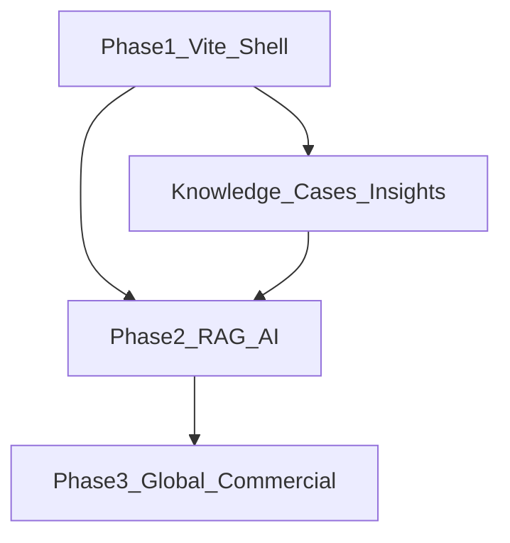

# Open Thermal AI — Website Transformation Plan

**Status:** Planning only — no code changes in this document’s scope.  
**Domain:** keep `www.jingyanrong.com`  
**Stack (Phase 1):** Vite + multi-page static + Vanilla JS (no Next.js / FastAPI yet)

**Current baseline (as of 2026-07):** A Phase 1 shell already exists in-repo (Open Thermal AI nav, `ai-engineer.html` mock, `tools.html`, `cases.html`, `founder.html`, dark theme tokens). **Frontend strategy layer (2026-07):** homepage platform IA, public `roadmap.html`, Services Open Core + Professional Services, Knowledge branded Open Knowledge + Dataset placeholders. This plan remains the **product north star**; AI live backend is still Phase 2.

---

## Dual-brand strategy

| Layer | Name | Role |
|-------|------|------|
| **Primary** | Open Thermal AI | Global industrial heat-pump AI / knowledge / tools platform |
| **Founder** | Jing Yanrong | Credibility: 30+ years R&D, consulting, training — *not* the site’s primary identity |

Footer / Founder strip pattern:

```
Open Thermal AI
Founded by Jing Yanrong · Industrial Heat Pump Expert
```

Do **not** remove the personal brand; demote it from hero/nav brand to Founder + “Founded by”.

---

## Target users

1. **B2B engineers** — heat-pump / HVAC / energy consultants  
2. **Industry owners** — food, chemical, drying, district heating, waste-heat  
3. **Learners** — students, researchers, early-career engineers  

Core job: *help global engineers solve industrial heat-pump problems* (not “introduce who I am”).

---

# A. Sitemap

## Level 1 (primary nav)

| Route | Page | Purpose |
|-------|------|---------|
| `/` | Home | Platform value proposition; route users into AI / Knowledge / Tools / Cases / Founder |
| `/ai-engineer.html` | AI Thermal Engineer | UI framework + future design assistant entry (no live LLM in Phase 1) |
| `/tools.html` | Tools Center | Unified engineering calculators + standards entry |
| `/knowledge.html` | Knowledge hub | RAG-ready knowledge taxonomy + chapter navigation |
| `/cases.html` | Case Library | Structured industrial cases by industry / application |
| `/services.html` | Services | Single B2B delivery system (Annex 58 frame + consulting narrative) |
| `/founder.html` | Founder | Jing Yanrong credibility; platform creator story |

**Insights / briefings** (current `/articles.html`, `/briefings/*`, `/insights/*`):  
Not a top-nav item in this IA. Map under **Knowledge → Research Insights** (and keep URLs for SEO). Optional secondary entry from Home “Latest”.

## Level 2 — AI Thermal Engineer

| Route | Purpose |
|-------|---------|
| `/ai-engineer.html` | Form / chat shell; disclaimer; sample or mock output |
| *(Phase 2)* report view / PDF | Design report download |

## Level 2 — Tools Center

| Group | Items (examples) | Notes |
|-------|------------------|-------|
| Thermodynamic Tools | COP calc (future), heat balance (future), refrigerant comparison → TPC / refrigerants knowledge | Mix live external tools + future in-site |
| Design Tools | Heat pump sizing → MC; temperature lift analysis (future); HTHP configs A–I | Keep subdomain calculators |
| Economic Tools | Energy saving / payback → BA | |
| Components / Specialty | Flash tank, separator, compressors, expander, storage | Open + invite-only |
| Standards | `/heat-pump-standards.html` | Standards / policies / links |
| AI Assisted (future) | Design assistant, tool explain | Placeholder only in Phase 1 |

## Level 2 — Knowledge (RAG-oriented)

Stable **corpus IDs** = `slug` + language fields + optional FAQ blocks.

```
Knowledge
├ Industrial Heat Pump          → knowledge hub basics + cycles
├ High Temperature Heat Pump    → hthp-column.html + advanced outlines
├ CO₂ Heat Pump                 → knowledge CO₂ / refrigerants / cycles sections
├ Refrigerants                  → knowledge-refrigerants.html
├ Compressor Technology         → knowledge-compressor.html
├ Heat Exchanger Technology     → knowledge-exchanger.html
├ System Design                 → vessels, valves, lubricants, electrical, piping, enclosure
├ Industrial Applications       → cross-link Cases + application vignettes
├ Standards                     → heat-pump-standards.html (or Tools child)
└ Research Insights             → articles.html + briefings/ + insights/
```

## Level 2 — Cases

| Hub filter | Detail route |
|------------|--------------|
| Food / Chemical / Drying / Waste Heat Recovery / District Heating / Other | `/cases/{slug}.html` |

Case schema (content fields): Industry, Temperature requirement, Heat source, Heat sink, Refrigerant, System solution, Energy saving result, Technical lessons (+ FAQ for SEO).

## Level 2 — Services (one system, not two)

Keep **Annex 58 Task 1–5** as the *delivery spine* (already in site). Overlay *user-facing* labels:

| User-facing label | Maps to |
|-------------------|---------|
| Industrial Heat Pump Consulting | Hub + Task 2/3 |
| System Design | Task 1–2 |
| Technology Evaluation | Task 1 |
| Energy Optimization | Task 2–3 |
| Specs & Testing | Task 4 |
| Training / Dissemination | Task 5 |
| AI Engineering Assistance (future) | Link to AI Engineer |

Do **not** resurrect old lifecycle pages (survey → EOL) as a parallel IA.

## Level 2 — Founder

Single page: narrative, focus matrix, resume (gated if desired), contact CTA, “Founded Open Thermal AI”.

---

# B. Wireframes (structure)

Shared chrome: **Header** (brand Open Thermal AI + 7 nav + lang + search + What’s New) · **Footer** (Founded by Jing Yanrong · contact · disclaimer · ICP).

### B1. Home `/`

```
[Header]
[Hero — full-bleed dark]
  Open Thermal AI
  Industrial Heat Pump Intelligence Platform
  Knowledge. Engineering Tools. AI Design Assistance.
  [Ask AI Thermal Engineer] [Explore Knowledge] [Use Engineering Tools]
  Founded by Jing Yanrong · Industrial Heat Pump Expert  (subtle)

[Main]
  1. AI Assistant entry card → /ai-engineer.html
  2. Knowledge system snapshot → /knowledge.html
  3. Engineering Tools featured 3–4 → /tools.html + external
  4. Global Cases highlights → /cases.html
  5. Founder credibility strip → /founder.html

[Footer]
```

No portrait-as-hero; no sole “Book 15-min” primary CTA.

### B2. AI Thermal Engineer

```
[Header]
[Hero kicker] AI Thermal Engineer · ChatGPT for industrial heat pumps (aspirational)
[Two columns]
  Left: free-text + structured fields (source/sink/load/refrigerant) · [Run]
  Right: Concept · Refrigerant · Compressor · COP · HX · Risks · disclaimer
[Secondary] Design report PDF — Coming (Phase 2)
[Footer]
```

Phase 1: UI framework + mock/rules only. Phase 2: same layout, live API.

### B3. Tools Center

```
[Header]
[Hero] Engineering Tools · auditable physics
[Taxonomy filters] Thermodynamic | Design | Economic | Components | Standards | Invite-only
[Card grid] existing calculators + Coming soon HTHP A–I
[Per card] Launch · View source · AI explain (disabled)
[Standards strip] → heat-pump-standards.html
[Footer]
```

### B4. Knowledge

```
[Header]
[Hub hero + directory tree — RAG taxonomy above]
[Chapter pages] existing long-form layout; breadcrumb Open Thermal AI / Knowledge / …
[FAQ block] on key articles (SEO + chunking)
[Footer]
```

### B5. Cases

```
[Header]
[Hero] Global Industrial Heat Pump Case Library
[Industry filters]
[Card grid]
[Detail] Background · Temps · Source/Sink · Refrigerant · Solution · Savings · Lessons · FAQ
[Footer]
```

### B6. Services

```
[Header]
[Hero] Engineering services · Annex 58–aligned delivery
[User-facing service cards] → Task pages
[CTA] Contact / diagnostic (secondary to platform CTAs)
[Footer]
```

### B7. Founder

```
[Header]
[Hero] Jing Yanrong · Founder & Chief Thermal Architect
[30+ years · Research / Engineering / Consulting / Training]
[Focus matrix]
[Relation to Open Thermal AI]
[Contact CTA]
[Footer]
```

---

# C. Old → New mapping

| Old | New | Action |
|-----|-----|--------|
| Brand「Jing Yanrong」 | Brand「Open Thermal AI」+ Founded by | Rebrand |
| Home hero (personal) | Platform hero | Rewrite |
| Content / articles | Knowledge → Research Insights | Demote from top nav; keep URLs |
| Briefings / Insights | Research Insights | Keep; optional Case dual-tag |
| Knowledge chapters | Knowledge taxonomy (RAG tree) | Reorganize labels; keep file URLs |
| Tools & Standards / `#apps` | Tools Center `/tools.html` | Upgrade / migrate |
| heat-pump-standards.html | Tools → Standards | Keep file; change entry path |
| Services Annex 58 | Services (single system) | Keep Tasks; overlay user labels |
| Old lifecycle services-* | — | Do not restore |
| About `#about` | `/founder.html` | Move |
| Calculators (subdomains) | Tools cards | Aggregate; do not rewrite engines |
| — | `/ai-engineer.html` | New (UI only Phase 1) |
| — | `/cases.html` + `/cases/*` | New library |
| OG「个人网站」 | Organization + SoftwareApplication + Person | SEO upgrade |
| Light green glass | Dark industrial AI | Visual upgrade |

### Delta vs current shell (reconciliation)

| This plan | Current shell | Next implementation delta |
|-----------|---------------|---------------------------|
| Top nav **without** Insights | Insights still a chip | Move Insights under Knowledge; remove chip or demote |
| Tools taxonomy Thermo/Design/Economic/AI | Design/Thermo/Components/Standards/HTHP | Relabel filters + hub groups |
| Knowledge by application themes | Fundamentals/Advanced/Components/… | Remap hub labels to RAG tree |
| Cases: drying / DH / WHR filters | food/chemical/manufacturing seeds | Extend filters + schema fields |
| Services user-facing overlay | Annex 58 titles only | Add consulting labels without second tree |
| “Founded by” on Home | Strip exists; strengthen copy | Copy pass |
| AI: UI framework, **no** product AI claim | Mock analyze already live | Soften marketing to “framework / preview” until Phase 2 |

---

# D. Phase roadmap

## Phase 1 — Platform shell (Vite static)

| | |
|--|--|
| **Objective** | Dual-brand platform IA, dark industrial UI, knowledge/cases/tools shells, AI UI placeholder + API contract |
| **Technology** | Vite · Vanilla JS · JSON content pipeline · EN/ZH |
| **Deliverables** | Nav + Home · Tools Center · Knowledge remapping · Case Library framework · Founder · AI page UI · Schema.org · What’s New · docs (IA/wireframe/API) |
| **Out of scope** | Live LLM, RAG, PDF reports, JA/DE, Next.js, FastAPI, rewriting calculators in-repo |

## Phase 2 — AI Thermal Engineer (backend)

| | |
|--|--|
| **Objective** | Real engineering Q&A / design assist on the same UI contract |
| **Technology** | Evaluate Next.js front · FastAPI · PostgreSQL · Vector DB · RAG over Knowledge + Cases + Insights |
| **Deliverables** | `POST /v1/thermal-engineer/analyze` live · tool explain · case recommendation · optional PDF report |

## Phase 3 — Global + commercial

| | |
|--|--|
| **Objective** | Multi-market reach and monetization |
| **Technology** | i18n EN/ZH/JA/DE · auth · enterprise API · billing hooks |
| **Deliverables** | Full localization · enterprise access · premium AI · expert services packaging |



---

# E. Design direction

**Keywords:** Dark · Industrial · AI · Engineering · Global · Professional · Future  

**Do:** deep navy/charcoal grounds; blue energy accents; subtle grid/equipment atmosphere; platform-first typography hierarchy; one job per section; Founder as credibility, not celebrity hero.

**Don’t:** personal-blog storytelling as primary IA; purple consumer-AI clichés; cream/serif “brochure” look; dashboard clutter in first viewport; portrait-dominated hero.

**Accessibility:** keep contrast on dark theme; disclaimers on all AI outputs (“engineering aid, not PE stamp”).

---

## Recommended next step (when coding resumes)

1. Align nav with this plan (Insights under Knowledge).  
2. Remap Knowledge hub + Tools filters to taxonomies above.  
3. Extend Case schema/filters (drying, DH, WHR).  
4. Soften AI page as “preview / framework” until Phase 2.  
5. Services overlay labels without splitting Annex 58.

**Do not** migrate stack until Phase 1 IA/content corpus is stable and RAG-ready.
